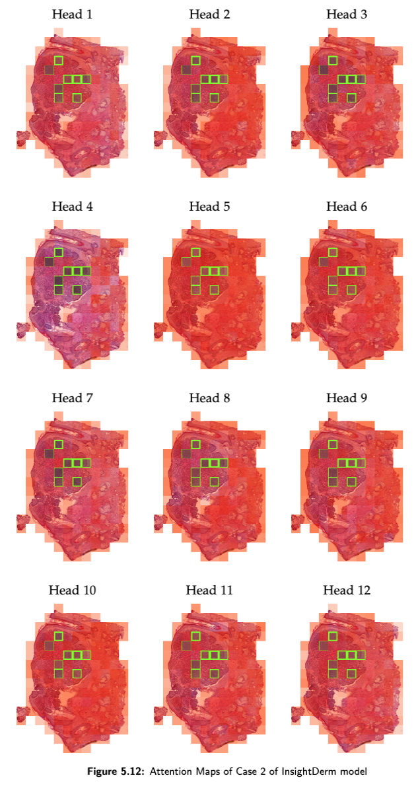
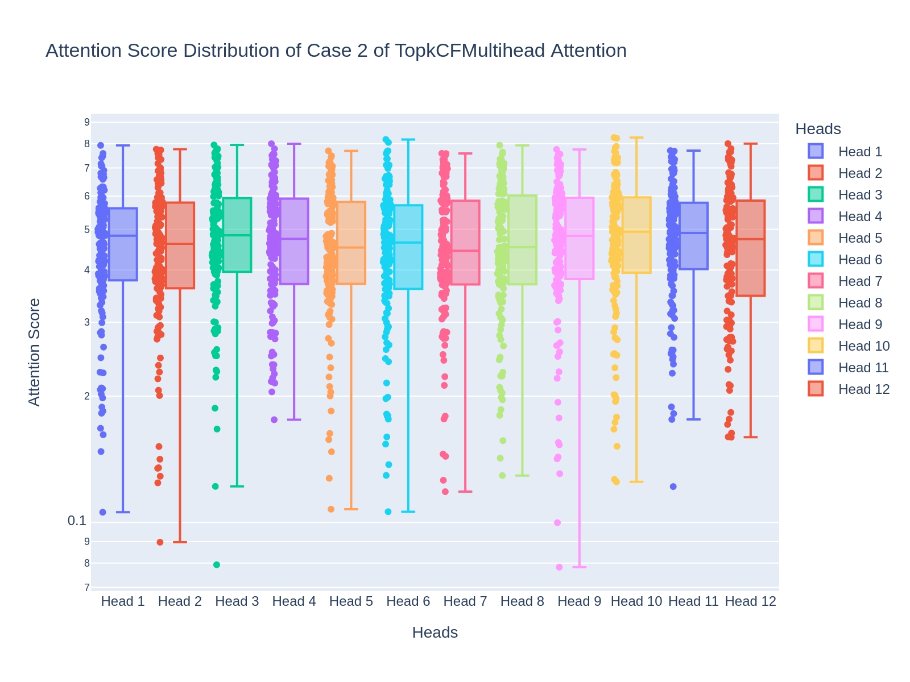

# InsightDerm
Top-k Critical Features Multi-Head Attention/ Top-K Critical Features Transformer in DSMIL for Dermatology.
Histopathology whole-slide imaging (WSI) is vital in diagnosing skin cancer. To enhance the accuracy and performance of skin cancer diagnosis, we have developed three innovative architectures: Topk Critical Features Multi-Head Attention, Top-K Critical Features Transformer, and a revised DSMIL Base model with sparsity. Our objective is to compare the performance of these models with Attention-Based MIL using a histopathological dermatology WSI dataset collected from KUK.

During the training process, InsightDerm performed better than other models in the validation set. However, when evaluated on the test set, the Sparse DSMIL Base model achieved the best results. It was noteworthy that both InsightDerm and InsightDerm-T demonstrated less stability during training compared to the DSMIL Base model and Attention-based MIL.

We experimented with three pre-trained models to explore various perspectives in feature encoding: ConvNeXt, Vision GNN, and Visual Attention Network. We expected combining these models in a combinatorial manner would yield optimal results. However, it was found that features encoded solely by ConvNeXt yielded the best performance compared to other combinations.

Our study leveraged the DSMIL Base model to localize tumors within the WSI dataset accurately. Additionally, we examined the attention maps generated by InsightDerm to gain insights into the crucial features contributing to the diagnostic process. However, interpreting the attention map of InsightDerm proved challenging as it exhibited different behavior than anticipated. The attention distribution pattern diverged significantly from the DSMIL Base model. In the DSMIL Base model, outlier attention scores indicated potential tumor regions, while most scores were considerably lower than the outliers. In contrast, InsightDerm displayed a smooth attention score distribution with rare outliers, and the scores were generally of similar magnitude, making differentiation challenging even when visualized.

These findings highlight the complexities involved in understanding and interpreting attention maps, which might be due to attention heads superposition. Further research and exploration are needed to unravel the underlying mechanisms and devise effective strategies for comprehending and leveraging Top-K Critical Features Multi-Head Attention in the diagnostic process.

By evaluating the performance of these models on the collected WSI dataset, we aim to assess their effectiveness in diagnosing skin cancer in histopathological dermatology. This analysis will provide valuable insights into their potential clinical application and impact.

<!-- 

 -->

